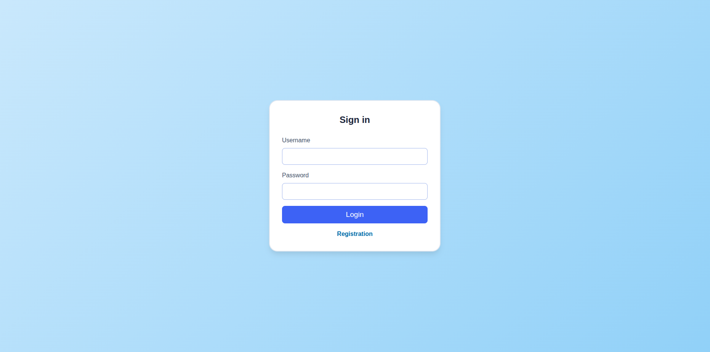
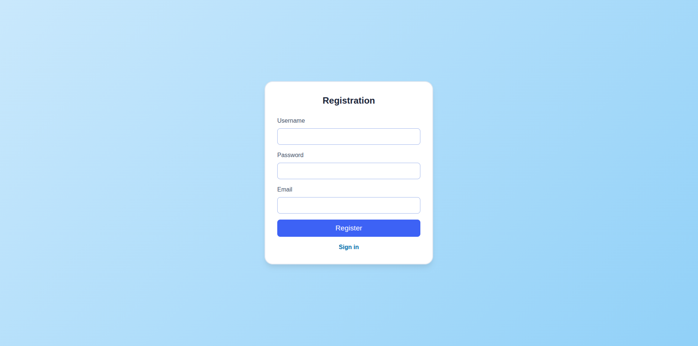
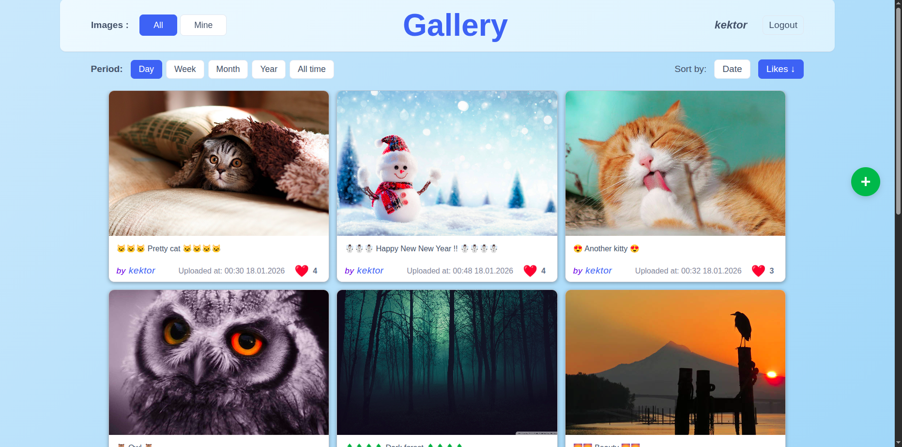
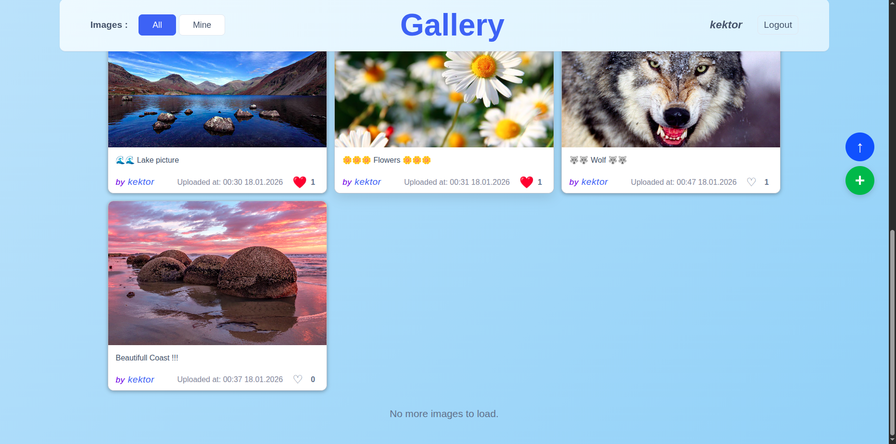
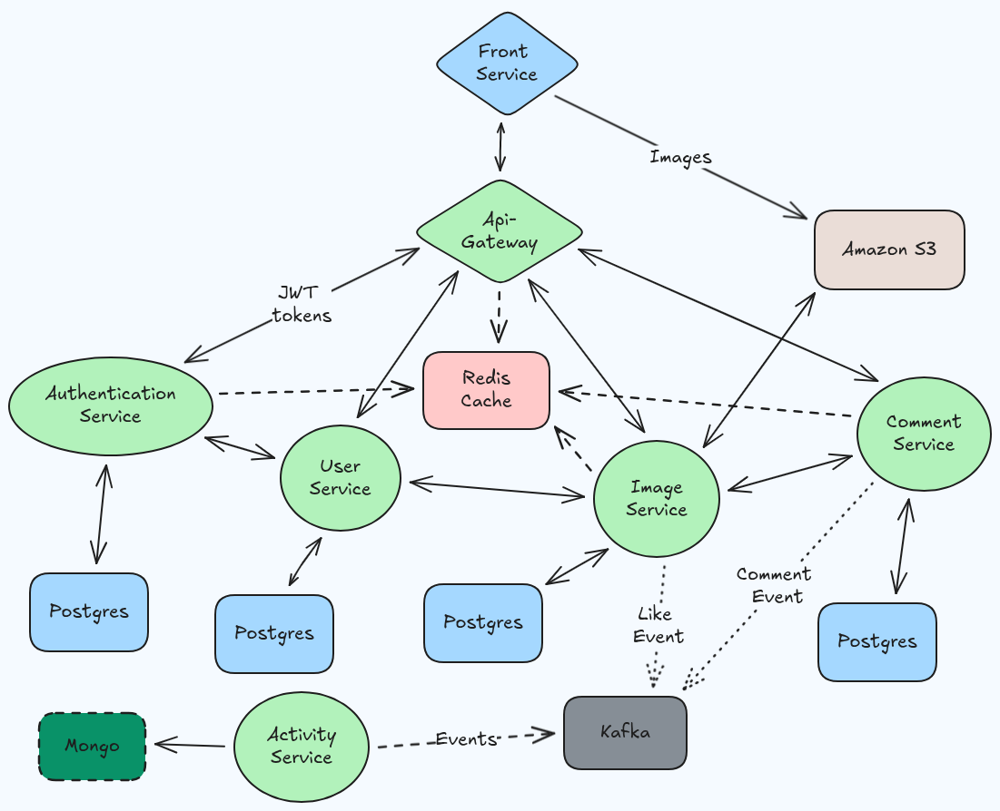

# 🖼️ Image Gallery Web application

A high-performance, distributed web application for image management, built with a focus on **Cloud-Native patterns**, **Event-Driven architecture**, and **DevOps best practices**.

This project showcases a modern Java/Kotlin ecosystem featuring 7+ microservices, automated CI/CD pipelines, and a custom security framework.

---

### 🌐 Web Interface
The frontend provides a clean and responsive experience, communicating with backend services through the API Gateway.
Implemented **dynamic sorting** by **date/likes** and ability to choose upload **date range**.
Also implemented **pull-down-to-refresh** mechanics for updating images and comments

|              Sign In              | Registration |
|:---------------------------------:| :---: |
|     |  |
| *JWT-based secure authentication* | *User profile creation via User Service* |

| Main Feed |        Image Modal View & Comments         |
| :---: |:------------------------------------------:|
|  |          |
| *S3-stored images with Redis caching* | *Real-time comments and activity tracking* |

|                     Images Endless Scroll                      |     Pull Down To Refresh For Images & Comments     |
|:--------------------------------------------------------------:|:--------------------------------------------------:|
|                               |  |
| *Efficient data fetching and pagination via endless scrolling* |             Convenient content refresh             |

## 🏗️ Architectural Overview

The system is designed with the **Database-per-Service** principle and utilizes an **API Gateway** for centralized ingress and security enforcement.

### 🧩 Core Services
*   **[Front Service](https://github.com/cannibal-kektor/gallery-front)**: A responsive SPA built with **React, Redux, and Axios**.
*   **[API Gateway](https://github.com/cannibal-kektor/api-gateway)**: Built on **Spring Cloud Gateway**. Implements routing, **Rate Limiting**, Request Size filtering, and **HTTPS termination**. It validates JWT tokens and relays user identity to downstream services.
*   **[Image Service](https://github.com/cannibal-kektor/gallery-image-service)**: Manages metadata (Postgres) and binary storage via **Amazon S3** (using **LocalStack** for local dev). Implements **S3 Signed URLs**, Caffeine L1 cache, and Spring Retry.
*   **[Authentication Service](https://github.com/cannibal-kektor/gallery-authentication-service)**: Handles user credentials and issues **Access/Refresh tokens**. Uses **Redis** for session management and PostgreSQL for persistence.
*   **[Activity Service](https://github.com/cannibal-kektor/gallery-activity-service)**: A **Kotlin-based** analytics service. It consumes events from **Kafka** (emitted by Image/Comment services) and stores user logs in **MongoDB**.
*   **[User Service](https://github.com/cannibal-kektor/gallery-user-service)**:  Microservice for profile management with isolated Postgres database and Redis caching.
*   **[Comment Service](https://github.com/cannibal-kektor/gallery-comment-service)**: Dedicated microservice for social interactions with isolated Postgres database and Redis caching.
---

## ⚙️ Engineering & DevOps

### 🔄 Optimized CI/CD Pipeline
Integrated with a professional **GitHub Actions** workflow:
1.  **Continuous Integration**: Automated builds and comprehensive testing (Unit + Integration).
2.  **Quality Gate**: Static code analysis via **SonarQube** to monitor security vulnerabilities and code smells.
3.  **Containerization**: Automated **Multi-stage Docker builds** to create optimized, minimal images.
4.  **Continuous Delivery**: Verified images are automatically pushed to **DockerHub**.

### 🛡️ Custom Spring Boot Starter
To ensure DRY principles, I developed a **shared Spring Boot Starter**. It automatically configures Spring Security to validate internal identity headers injected by the API Gateway, securing all backend communication.

### 🚀 Resilience & Observability
*   **Fault Tolerance**: Implemented **Spring Retry** for kafka operations and **Testcontainers** for reliable integration testing.
*   **Monitoring**: Full **Spring Actuator** integration provides Readiness/Liveness health checks for Kubernetes orchestration.
*   **Performance**: Hybrid caching strategy using **Caffeine (L1)** and **Redis (L2)**.

---

## 🛠️ Tech Stack

| Layer | Technologies                                                                       |
| :--- |:-----------------------------------------------------------------------------------|
| **Backend** | Java, Kotlin, Spring Boot, Spring MVC, Spring Webflux, Spring Data, Spring Cloud   |
| **Messaging** | Apache Kafka                                                                       |
| **Databases** | PostgreSQL, MongoDB, Redis                                                         |
| **Infrastructure** | AWS S3 (LocalStack), Liquibase, OpenAPI/Swagger                                    |
| **DevOps** | Docker, Kubernetes, Helm Charts, GitHub Actions, SonarQube                         |
| **Testing** | JUnit 5, Mockito, Testcontainers                                                   |

---

## 📦 Deployment

The ecosystem is ready for both local development and cloud scale:

1.  **Docker Compose**: Use the **[gallery-docker-compose](https://github.com/cannibal-kektor/gallery-docker-compose)** repository to spin up the entire stack (including Kafka and LocalStack)

2.  **Kubernetes**: Deploy to a cluster using the **[gallery-helm-charts](https://github.com/cannibal-kektor/gallery-kubernetes)** repository, featuring a centralized **Umbrella Helm Chart**.

---

## 🔗 Repository Navigation

| Repository                                                                                                                     | Role | Stack                        |
|:-------------------------------------------------------------------------------------------------------------------------------| :--- |:-----------------------------|
| **[front-service](https://github.com/cannibal-kektor/gallery-front)**                                                          | UI / Frontend | React + Redux                |
| **[api-gateway](https://github.com/cannibal-kektor/api-gateway)**                                                              | Ingress & JWT Filter | Java + Spring Cloud          |
| **[auth-service](https://github.com/cannibal-kektor/gallery-authentication-service)**                                          | Identity & Tokens | Java + Redis + Postgres      |
| **[user-service](https://github.com/cannibal-kektor/gallery-user-service)**                                                                                                     | User Profiles | Java + Postgres              |
| **[image-service](https://github.com/cannibal-kektor/gallery-image-service)**                                                                                                    | Media & S3 Logic | Java + S3 + Redis + Postgres |
| **[comment-service](https://github.com/cannibal-kektor/gallery-comment-service)**                                                                                                  | Social Interactions | Java + Redis + Postgres      |
| **[activity-service](https://github.com/cannibal-kektor/gallery-activity-service)**                                                                                                 | Kafka Analytics | Kotlin + Kafka + MongoDB     |
| **[auth-starter](https://github.com/cannibal-kektor/gallery-security-starter)**                                                                                                     | Internal Security Lib | Java + Spring Security       |
| **[docker-compose-repo](https://github.com/cannibal-kektor/gallery-docker-compose)**                                                                                              | Orchestration | Docker Compose               |
| **[helm-charts-repo](https://github.com/cannibal-kektor/gallery-kubernetes)**                                                                                                 | K8s Deployment | Helm (Umbrella Chart)        |
